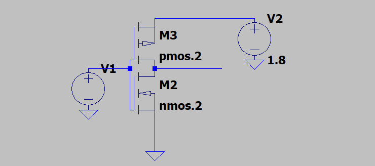
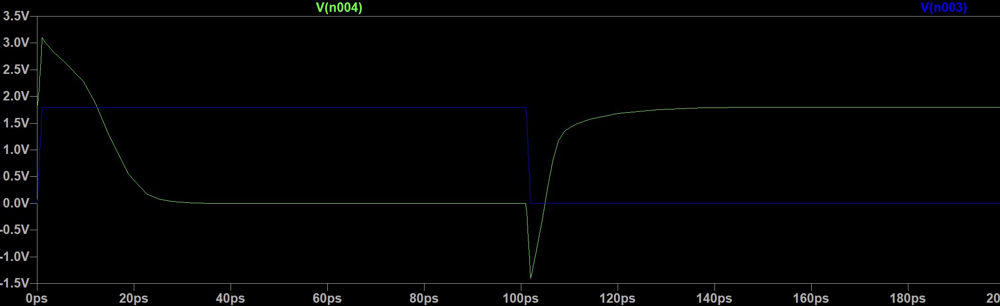
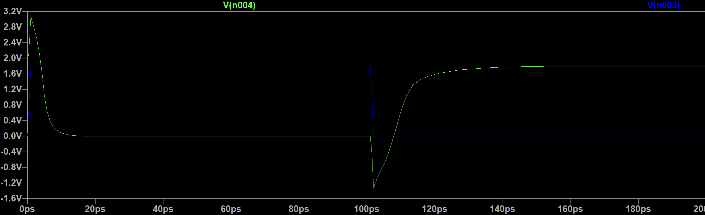
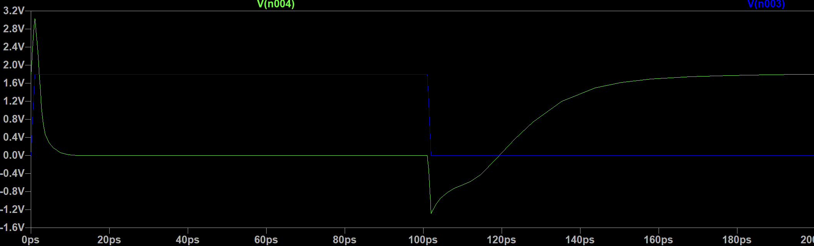
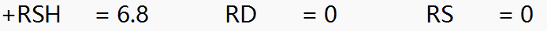
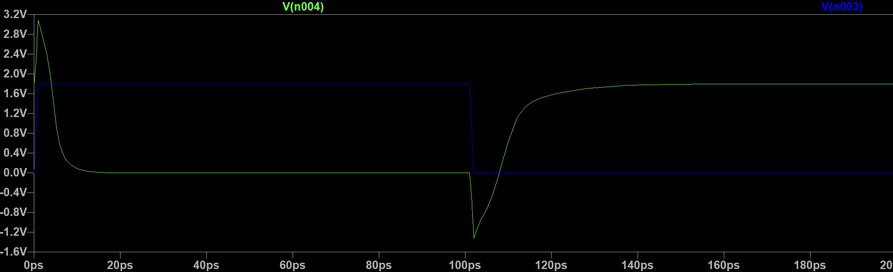
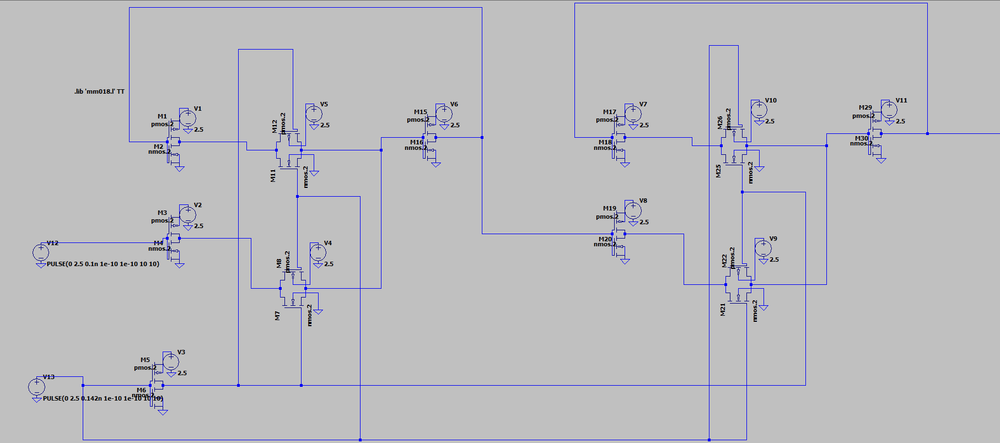
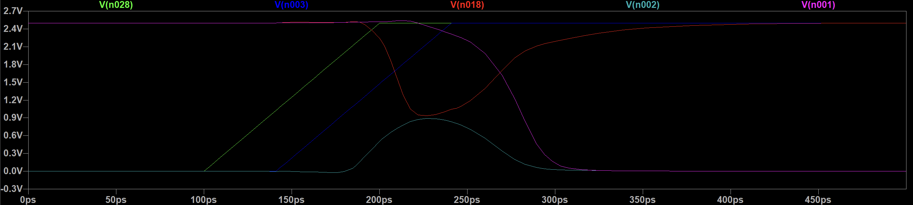
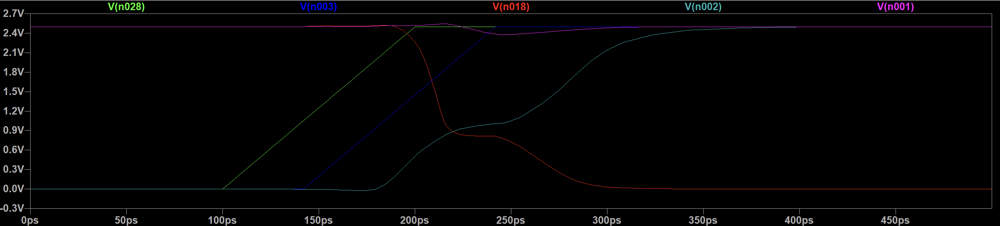
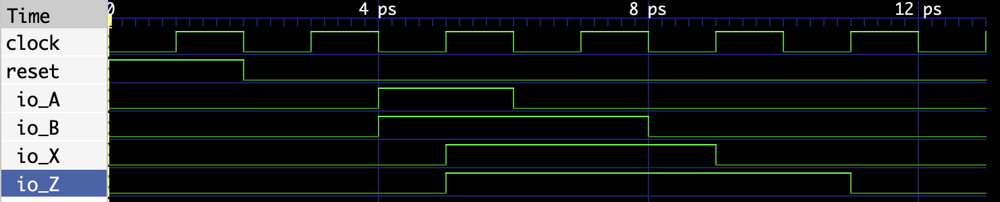

# 超大规模集成电路设计基础 实验作业

## 1

为了对CMOS反相器进行仿真，我在LTSPICE中搭建了如下电路：



其中，pmos和nmos分别使用了课程群中的mm018.l仿真库进行实现。由于该仿真库中只有工作电压1.8V和3V的MOS，所以我们这里选择了$V_{DD}=1.8V$，并按照实验要求配置了所有MOS的长度参数。

随后，我选取了如下三组宽度比进行实验：

1. $W_n=13.6\mu s$，$W_p=80 \mu s$，$W_n/W_p=0.170$
2. $W_n=13.6\mu s$，$W_p=14.4 \mu s$，$W_n/W_p=0.944$
3. $W_n=80\mu s$，$W_p = 14.4\mu s$，$W_n/W_p=5.556$

各组波型如下所示（绿线为输出电压，蓝线为输入电压）：

1. $W_n=13.6\mu s$，$W_p=80 \mu s$，$W_n/W_p=0.170$

   

2. $W_n=13.6\mu s$，$W_p=14.4 \mu s$，$W_n/W_p=0.944$

   

3. $W_n=80\mu s$，$W_p = 14.4\mu s$，$W_n/W_p=5.556$

   

根据以上实验，我们可以大致得出以下结论：在器件长度相同的情况下，$W_n/W_p$越大，$t_{pHL}$越小，$t_{pLH}$越大；$W_n/W_p$越小，$t_{pHL}$越大，$t_{pLH}$越小。


## 2

根据教材中的公式可得，当电压足够大时时，要使门延迟最小，那么$\beta=\frac{(W/L)_p}{(W/L )_n}$应该等于$\sqrt{r}$，其中$r$为尺寸完全相同的PMOS和CMOS的晶体管电阻比。查阅库文件可知这二者的电阻信息：

* PMOS：

  

* NMOS：

  

由此可知：
$$
\beta = \sqrt{7.2/6.8}=1.057
$$
那么对于第一题中的情况，由于二者长度相同，故我们可以设出符合关系的宽度：$W_n=20\mu s$，$W_p=21.14\mu s$，得到的仿真波形如下：




## 3

首先，我使用LTSPICE搭建了电路。这里依然使用了前两题给出的MOS管配置：



通过调整V13（CLK）的启动延迟，可以逐步观察寄存器建立的极限建立时间。当CLK在D之后0.41ns开始置位时，波型如下：



可以看到，此时和给出的参考类似，恰好没有建立成功。而当CLK在D之后0.42ns开始置位时，波型如下：



这时恰好建立成功。由于个人配置有限，我无法继续进行更高精度的实验，故可以认为寄存器建立时间$t_{setup}=0.42ns$

## 4

在这个实验中，我使用chisel生成verilog，并借用以Verilator为后端的ChiselTest生成波型。chisel生成的Verilog如下，可见与题目中等效：

```verilog
module Dut(
  input  clock,
         reset,
         io_A,
         io_B,
  output io_X,
         io_Z
);

  reg X_reg;
  reg Z_reg;
  always @(posedge clock) begin
    if (reset) begin
      X_reg <= 1'h0;
      Z_reg <= 1'h0;
    end
    else begin
      X_reg <= io_B;
      Z_reg <= Z_reg & X_reg | io_A;
    end
  end // always @(posedge)
  assign io_X = X_reg;
  assign io_Z = Z_reg;
endmodule
```

由于题目中A和B的输入波形不是时钟沿对齐的，这对于行为仿真的实现是比较困难的，因此我构建了与题目中功能等效的下降沿对其的A和B输入。由于行为仿真不考虑模拟电路的建立时间等参数，故这样的波型依然是等效的：


