# 超大规模集成电路设计基础 HW

## Q1

> PMOS和NMOS晶体管有相同的$W$，$L$尺寸，并且他们的 $V_{gs}$，$V_{ds}$也相同，该电压使PMOS和NMOS同时处于饱和工作区，请问哪个晶体管的饱和电流更高，为什么？

（P62）

NMOS的饱和电流更高。在饱和区的漏极电流计算公式为：
$$
I_D=\frac12 \mu_nC_{ox}\frac WL (V_{gs}-V_T)
$$
其中，$\mu_n$为载流子迁移率。PMOS的载流子是空穴，而NMOS的载流子是电子，电子的迁移率大于空穴，因此同样的电场下，NMOS的饱和电流要大于PMOS。

## Q2

> MOS管的沟道设计长度$L_d$为何与沟道实际长度L（有效沟长）不同，原因何在？

在实际制造中，MOSFET的源极和漏极区域是通过扩散工艺（或离子注入）形成的，导致有源区边界在水平方向上延伸一部分与栅极重叠，从而侵占部分设计沟道长度 $L_d$，使得$L_d > L$。

## Q3

> 论述静态 CMOS 反相器的工作原理及其优点。

1. 工作原理：（P118）

   输入$V_{in}$为高且等于$V_{DD}$时，PMOS截止，NMOS导通，输出节点和接地节点之间 存在直接通路，$V_{out}$为稳态值0V；输入$V_{in}$为低（0V）时，PMOS导通，NMOS截止，输出节点和电源$V_{DD}$之间存在直接通路，$V_{out}$产生了一个高电平输出电压。

2. 优点：（P118-119）

   * 输出高电平和低电平分别为$V_{DD}$和$GND$，电压摆幅等于电源电压，噪声容限很大。
   * 逻辑电平与器件相对尺寸无关，所以晶体管可采用最小尺寸。
   * 稳态时在输出和$V_{DD}$或$GND$之间总存在一条具有有限电阻的通路，具有低输出阻抗，使得它对噪声和干扰不敏感。
   * 输入电阻极高，稳态输入电流几乎为0。
   * 在稳态工作情况下电源线和地线之间没有直接通路，没有电流存在，不消耗任何静态功耗。

## Q4

> 论述栅漏电容的密勒效应。

（P128）

集总电容模型要求用接地电容来代替浮空的栅漏电容，这是通过考虑密勒效应实现的。在由低至高或由高至低的过渡中，栅漏电容两端的电压向相反方向变化，因此在这一浮空电容上的电压变化是实际输出电压摆幅的两倍。为了在输出节点上出现同样的负载，接地电容的值必须是浮空电容的两倍：
$$
C_{gd}=2C_{GD0}W
$$

## Q5

> 什么是MOS器件的体偏置效应，给出在体偏置条件下的MOS的阈值电压$V_T$。

（P60）

阈值电压$V_T$除了与材料常数有关外，还与源-体电压$V_{SB}$有关：
$$
V_T=V_{T0}+\gamma(\sqrt{|(-2)\phi_F+V_{SB}|}-\sqrt{|2\phi_F|})
$$

## Q6

> 什么是扇入和扇出，说出扇入和扇出不能太大的原理。

（P17）

* 扇入：
  * 扇入是逻辑门的输入数目。
  * 扇入增加会导致该逻辑门内部的关键路径上的晶体管数量增加，从而导致输出点的负载电容增加。
* 扇出：
  * 扇出表示连接到驱动门输出端的负载门数目。
  * 增加扇出会导致输出端外部负载电容增加，延迟增加，动态动态特性变差；外部负载电阻降低，相对输出点的电压降低，静态特性变差。

## Q7

> 说明门延时的概念。

（P18）

一个门的传播延时$t_p$定义了它对输入端信号变化的响应有多快。它表示一个信号通过一个门时所经历的延时，定义为输入和输出波形的50%反转点之间的时间。由于一个门对上升和下降输入波形的响应时间不同，所以需要定义两个传播延时。$t_{pLH}$定义为这个门输出由低至高翻转的响应时间，$t_{pHL}$定义为这个门输出由高至低翻转的响应时间，传播延迟为这两个时间的平均值。

## Q8

> 简述门的驱动强度、尺寸、电流、电阻、电容之间的关系。

门的尺寸越大，驱动强度越大，电流越大，电阻越小，电容越大。

## Q9

> 一数字电路符合一阶RC网络传播延时模型（如下图），$V_{in}$从$0\rightarrow VDD$的阶跃变化，求该数字电路$V_{out}$ 从$0.2V_{DD}\rightarrow 0.8V_{DD}$的时间。
>
> 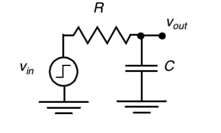

（P20）

一阶RC网络的输入从0至$V$变化时，输出变化为：
$$
V_{out}(t)=(1-e^{-t/\tau})V
$$
由题目可知列出如下两个方程：
$$
0.2V_{DD}=(1-e^{-t_1/\tau})V_{DD} \\
0.8V_{DD}=(1-e^{-t_2/\tau})V_{DD}
$$
求解可得$t_1=-\tau\ln0.8$，$t_2=-\tau\ln0.2$，从而$V_{out}$ 从$0.2V_{DD}\rightarrow 0.8V_{DD}$的变化时间为$t_2-t_1=\tau\ln0.4$

## Q10

> 静态 CMOS 反相器的器件参数如下：
>
> NMOS：$V_{Tn}=0.4V$，$V_{DSATn}=0.63V$，$\mu_nC_{ox}=115\mu A/V^2$；
>
> PMOS：$V_{Tp}=-0.4V$，$V_{DSATp}=-1V$，$\mu_pC_{ox}=-30\mu A/V^2$；
>
> 电源电压 $V_{DD}=2.5V$，实际沟道长度 $L_n=L_p=0.25\mu m$，
>
> 1. 请确定 $W_p/W_n$的比值，使反相器的开关阈值 $V_M=1.25V$（注：忽略沟长调制作用影响）；
> 2. 如果 $W_n/L_n=2$，$W_p/L_p=3$ 时（注：$\lambda_n=0.06V^{-1}$，$\lambda_p=-0.1V^{-1}$），求反相器的开关阈值$V_M$和噪声容限 $N_{MH}$，$N_{ML}$；
> 3. 如果两个完全相同的反相器串联，$W_n=0.75\mu m$、$L_n=0.25\mu m$，反相器下拉时的扩散电容$C_{dp}=1.5fF$、$C_{dn}=0.66fF$，覆盖电容$C_{gn}=0.76fF$、$C_{gp}=2.28fF$，连线电容$C_W=0.12fF$，近似计算由高到低的传播延时 $t_{pHL}$。

1. （P122，P61）
   $$
   \begin{align}
   \frac{(W/L)_p}{(W/L)_n} &= |\frac{k'_nV_{DSATn}(V_M-V_{Tn}-V_{DSATn}/2)}{k'_pV_{DSATp}(V_{DD}-V_M+V_{Tp}+V_{DSATp}/2)}| \\
   &= |\frac{\mu_nC_{ox}V_{DSATn}(V_M-V_{Tn}-V_{DSATn}/2)}{\mu_pC_{ox}V_{DSATp}(V_{DD}-V_M+V_{Tp}+V_{DSATp}/2)}|  \\
   &=|\frac{115\times0.63\times(1.25-0.4-0.63/2)}{-30\times(2.5-1.25-0.4-1/2)}| \\
   &= 3.6915
   \end{align}
   $$
   由于$L_n=L_p$，故$W_p/W_n = 3.6915$。

2. （P121，P124，P64，P62，P123）
   $$
   \begin{align}
   r&=\frac{k_pV_{DSATp}}{k_nV_{DSATn}}\\
   &=\frac{|\mu_pC_{ox}|(W_p/L_p)V_{DSATp}}{|\mu_nC_{ox}|(W_n/L_n)V_{DSATn}} \\
   &=\frac{30\times3\times 1.0}{115\times 2\times 0.63} \\
   &= 0.6211
   \end{align}
   $$

   $$
   \begin{align}
   V_M &=\frac{(V_{Tn}+V_{DSATn}/2)+r(V_{DD}+V_{Tp}+V_{DSATp}/2)}{1+r} \\
   &=\frac{(0.4+0.63/2)+0.6211\times(2.5-0.4-1/2)}{1+0.6211} \\
   &= 1.0541V
   \end{align}
   $$

   $$
   \begin{align}
   I_D(V_M) &= k'_n\frac WL V_{DSATn}(V_M-V_{Tn}-V_{DSATn}/2)(1+\lambda_nV_M)\\
   &=115\times10^{-6}\times2\times0.63\times(1.0541-0.4-0.63/2)\times(1+0.06\times 1.0641) \\
   &=5.2231\times10^{-5}A
   \end{align}
   $$

   $$
   \begin{align}
   g &= -\frac1{I_D(V_M)}\frac{k_nV_{DSATn}+k_pV_{DSATp}}{\lambda_n-\lambda_p} \\
   &=\frac{1}{5.2231\times10^{-5}}\times\frac{115\times10^{-6}\times2\times0.63+30\times10^{-6}\times3\times1}{0.06+0.1}\\
   &= -28.1
   \end{align}
   $$

   $$
   V_{1H}=V_M-\frac{V_M}{g} = 1.09V
   $$

   $$
   V_{1L}=V_M+\frac{V_{DD}-V_M}{g}=1.00V
   $$

3. （P127-133）
   $$
   C_L=C_{dp}+C_{dn}+C_{gp}+C_{gn}+C_W = 5.32fF
   $$

   $$
   \begin{align}
   t_{pHL}&=0.69\frac34\frac{C_LV_{DD}}{I_{DSATn}} \\
   &=0.52\times\frac{C_LV_{DD}}{k'_n(W/L)_nV_{DSATn}(V_{DD}-V_{Tn}-V_{DSATn}/2)} \\
   &=0.52\times\frac{5.32\times10^{-15}\times2.5}{115\times10^{-6}\times0.75/0.25\times0.63\times(2.5-0.4-0.63/2)}\\
   &= 1.7826\times10^{-11}s
   \end{align}
   $$

   

## Q11

> $0.6\mu m$工艺的NMOS晶体管$t_{ox}=1\times10^{-8}m$，$\varepsilon_{ox}=3.5\times10^{-11}F/m$，电子迁移率$\mu_n=350cm^2 /V·s$，$W/L=2$，求 NMOS 增益。

（P61）
$$
\begin{align}
k_n&=\frac{\mu_n\varepsilon_{ox}}{t_{ox}}\times\frac WL \\ &= \frac{0.035\times3.5\times10^{-11}} \\{1\times10^{-8}}\times2\\&=2.45\times10^{-4}A/V^2
\end{align}
$$

## Q12

> 两个包含NMOS晶体管电路（如下图所示），NMOS的尺寸及电压情况如图中所标注，其余的工艺参数相同，NMOS均工作在电阻区，通过公式推导，验证$I_{DS1}=I_{DS2}$（流过两个串联的等长晶体管的电流等于流过一个两倍长度的晶体管的晶体管的电流）。
>
> 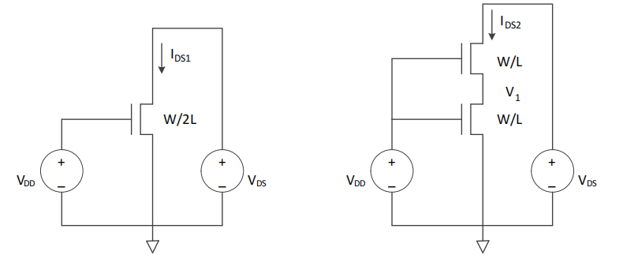

对于图(a)，根据电阻区工作的漏极电流计算公式可得：
$$
I_{DS1}=k'_n\frac W{2L}V_{DS}(V_{DD}-V_T-V_{DS}/2)
$$
而图(b)中，两个MOS的漏极电流是相等的，故可以根据电流列出方程：
$$
I_{DS2}=k'_n\frac WL V_1(V_{DD}-V_T-V_1/2) \\
I_{DS2}=k'_n\frac WL (V_{DS}-V_1)((V_{DD}-V_1)-V_T-(V_{DS}-V_1)/2)
$$
经化简可得：
$$
V_1^2-2(V_{DD}-V_T)V_1+V_{DS}(V_{DD}-V_T-\frac12V_{DS}) = 0
$$
将这个方程进行变形，可得：
$$
V_1(V_{DD}-V_T-V_1/2)=\frac12V_{DS}(V_{DD}-V_T-V_{DS}/2)
$$
带入$I_{DS2}$表达式：
$$
I_{DS2}=k'_n\frac W{2L}V_{DS}(V_{DD}-V_T-V_{DS}/2)
$$
由此可以验证$I_{DS1}=I_{DS2}$。

## Q13

> NMOS 晶体管的工艺参数如下：
>
> $t_{ox}=2\times10^{-8}m$，$W=10\mu m$，$L_d=1.5\mu m$，$x_d=0.25\mu m$，$L_S= L_D=5μm$，$x_j=0.4\mu m$，源区参杂浓度$N_D=1020原子/cm^3$，衬底参杂浓度 $N_A=10^{16} 原子/cm^3$，沟道阻挡层参杂浓度$N_{A+}=10^{19} 原子/cm^3$。计算在 300K 的温度下，
>
> 1. 分别求在 $V_D=5V$ 和 $2.5V$ 时的漏区扩散电容($q=1.6\times 10^{-19}C$)；
> 2. 求漏区的覆盖电容，$ε_{ox}=3.5\times 10^{-11}F/m$。
>
> （提示：利用电子教材上的公式（3.1）（3.2）（3.7）（3.8）（3.44）（3.45），AD=1）。

1. （P50，P54，P71-72）

   在300K下，硅的载流子浓度$n_i$为$1.5\times 10^{10}cm^{-3}$

   热电势：
   $$
   \phi_T=\frac{kT}{q}=0.0259V
   $$
   内建电势：
   $$
   \begin{align}
   \phi_0&=\phi_T\ln(\frac{N_AN_D}{n_i^2}) \\
   &= 0.026\times\ln\frac{10^{16}\times10^{20}}{(1.5\times10^{10})^2} \\
   &= 0.933V
   \end{align}
   $$
   当$V_D=5V$时（NMOS的$V_D$为负数）：

   单位面积零偏置下的电容：
   $$
   \begin{align}
   C_{j0}&=A_D\sqrt{\frac{\varepsilon_{si}q}2\frac{N_AN_D}{N_A+N_D}\phi_0^{-1}} \\
   &= 1\times\sqrt{\frac{11.7\times8.854\times10^{-12}\times1.6\times10^{-19}}{2}\times\frac{10^{22}\times10^{26}}{10^{22}+10^{26}}\times \frac1 {0.933}} \\
   &= 2.98\times10^{-4}F/m^2
   \end{align}
   $$
   单位面积耗尽层电容：
   $$
   \begin{align}
   C_j&=\frac{C_{j0}}{\sqrt{1-V_D/\phi_0}} \\
   &=\frac{2.98\times10^{-4}}{\sqrt{1-(-5)/0.933}} \\
   &= 1.18\times10^{-4}F/m^2
   \end{align}
   $$
   同理，带入$N_{A+}$，可以用相同的方法计算出单位周常电容：
   $$
   C_{jsw}=3.49\times10^{-3}
   $$
   扩散电容：
   $$
   \begin{align}
   C_{diff} &= C_{bottom}+C_{sw} \\
   &= C_jL_sW+C_{jsw}(2L_S+W) \\
   &= 1.18\times10^{-4} \times 5\times10^{-6}\times10\times10^{-6}\\
   &+3.49\times10^{-3}\times 0.4\times10^{-6}\times(2\times 5\times 10^{-6}+10\times10^{-6}) \\
   &= 3.38\times10^{-14}F
   \end{align}
   $$
   当$V_D=2.5V$时，同理可得$C_{diff}=4.43\times10^{-16}F$

2. （P61，P71）

   栅氧单位面积电容：
   $$
   C_{ox}=\frac{\varepsilon_{ox}}{t_{ox}}=1.75\times10^{-3}F/m^2
   $$
   覆盖电容：
   $$
   C_{GD}=C_{ox}Wx_d=4.375\times10^{-15}F
   $$
   

## Q14

> 有三个反相器组成的反相器链，输入电容为$C_i=1pF$，负载电容为 $C_L=1000pF$，如果第一个反相器的尺寸为1，在反相器链传播延时最小情况下，传播延时 $t_{p1}$ 为 70ps（注：$\gamma =1$），
>
> 1. 请确定其他两个反相器 $I_2$、$I_3$ 的尺寸，使反相器链的传播延时最小，并计算该情况下的最小延时；
> 2. 如果允许增加更多的反相器使反相器链的延时最小，请确定插入反相器的数目，并计算该情况下的最小延时。
>
> 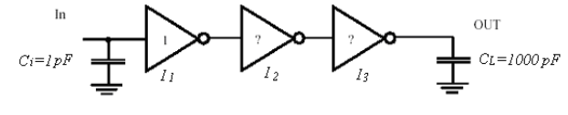

1. （P167-168或P137）

   

   电气努力（有效扇出）：
   $$
   F=\frac{C_L}{C_i} = 1000
   $$
   路径逻辑努力：
   $$
   G = \prod1=1
   $$
   该路径没有分支，故总努力为：
   $$
   H=GF=1000
   $$
   当传播延迟最小时，每一级都应该有相同的门努力$h$：
   $$
   h=\sqrt[3]{H}=10
   $$
   因此，$I_2$的尺寸为：
   $$
   (W/L)_2=f(W/L)_1=10
   $$
   $I_3$的尺寸为：
   $$
   (W/L)_3=f(W/L)_2=100
   $$
   根据方程：
   $$
   t_{p1}=t_{p0}(1+f/\gamma)
   $$
   可以求出$t_{p0}=6.36ps$

   

   由于有效扇出相同，故每一级延迟$t_{pi}=t_{p0}(p+gf/\gamma)=70ps$，因此总延迟：
   $$
   t_p=3\times70=210ps
   $$

2. （P137-138）

   此时$f$满足方程：
   $$
   f=e^{1+\gamma/f}
   $$
   当$\gamma=1$时，$f\approx 3.6$

   再结合$f=\sqrt[N]{F}=\sqrt[N]{H}$，可得到：
   $$
   N=\ln F/\ln f\approx5
   $$
   这时重新计算扇出$f=\sqrt[5]{1000}=3.98$

   由于电路已经发生变化，我们需要通过与门尺寸无关的$t_{p0}$来进行计算。总延迟可以得到为：
   $$
   t_p=Nt_{p0}(1+\sqrt[N]F/\gamma)=158ps
   $$

## Q15

> 逻辑门驱动的数据总线位宽为3bit，是由三根尺寸相同，距离相等的信号线A、B、C组成，两侧用地线屏蔽外部互联线串扰，总线的布线图、截面图及尺寸参数值如下图所示，其中 $W=0.4\mu m$，$S=0.6\mu m$，$H=0.4\mu m$，$T=0.6\mu m$
>
> 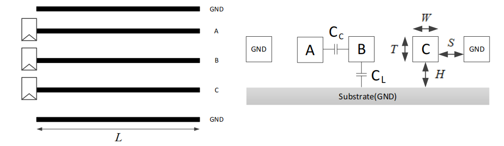
>
> 1. 计算信号线的对地单位电容$c_L$和信号线间的单位耦合电容 $c_C$，电介质介电常数$ε_r=3.45$
> 2. 受到信号线A和C的电压变化影响，信号线B会出现耦合电容的变化，分析产生最大耦合电容和最小耦合电容的情况，画出两种情况下的信号线A、B和C的电压变化波形图，并用密勒效应来计算两种情况下信号线B的单位总电容$c_T$；
> 3. 总线材料为 Al，其电阻率$\rho =2.7\times 10^{-8}\Omega·m$，计算信号线B的单位电阻；
> 4. 总线长度 $L=1.0mm$，用Elmore模型近似计算信号线B的最大延迟和最小延迟。

1. （P93-94）

   电容公式为：
   $$
   c=\frac{\varepsilon_r\varepsilon_0}{t_{di}}(W-H/2)+\frac{2\pi\varepsilon_r\varepsilon_0}{\lg(2t_{di}/H+1)}
   $$
   对于$c_L$，我们可以得到$t_{di}=H=0.4\mu m$，$W=W=0.4\mu m$，$H=T=0.6\mu m$，将这些参数带入公式：
   $$
   c_L=529.14pF/m
   $$
   而对于$c_C$，我们可以得到$t_{di}=S=0.6\mu m$，$W=T=0.6\mu m$，$H=W=0.4\mu m$，将这些参数带入公式：
   $$
   c_L=339.11pF/m
   $$

2. 最大耦合电容：A和C与B电流方向相反：

   

   此时，根据密勒效应（一个在其两端经历大小相同但相位相反的电压摆幅的电容可以用一个两倍于该电容值的接地电容来代替），A与B、C与B之间的电容都是$2c_C$，故总电容为：
   $$
   c_T=4c_C+c_L=1885.58pF
   $$
   最小耦合电容：A、B、C电流方向均相同：

   

   此时，A与B、C与B之间没有电容，因此总电容为：
   $$
   c_T=c_L=339.11pF/m
   $$

3. （P96）
   $$
   r = \frac{\rho }{TW}=\frac{2.7\times10^{-8}}{0.6\times0.4\times10^{-12}}=1.125\times10^5\Omega/m
   $$

4. （P103，P20）

   根据公式$\tau_{DN}=\frac{rcL^2}2$，时间常数随着电容变化而线性正相关变化，只需用最大最小电容带入即可。

   最大延迟时间常数：
   $$
   \tau_{DN}=\frac{r(4c_C+c_L)L^2}2=101.07\mu s
   $$
   按照输出电压到达输入的50%来带入一阶RC计算，最大延迟时间：
   $$
   t_{max}=\ln(2)\times \tau_{DN}=69.7383\mu s
   $$
   最小延迟时间常数：
   $$
   \tau_{DN}=\frac{rc_LL^2}2=29.76\mu s
   $$
   按照输出电压到达输入的50%来带入一阶RC计算，最小延迟时间：
   $$
   t_{min}=\ln(2)\times \tau_{DN}=20.5344\mu s
   $$

## Q16

> 1. 用互补CMOS门实现逻辑功能为$Out=\overline{AB+AC+BC} $的电路；
>
> 2. 用由NMOS构成下拉网络的多米诺门实现逻辑功能为$Out=\overline{AB+AC+BC} $的电路；
>
> 3. 写出下面 CMOS 电路的逻辑函数功能。
>
>    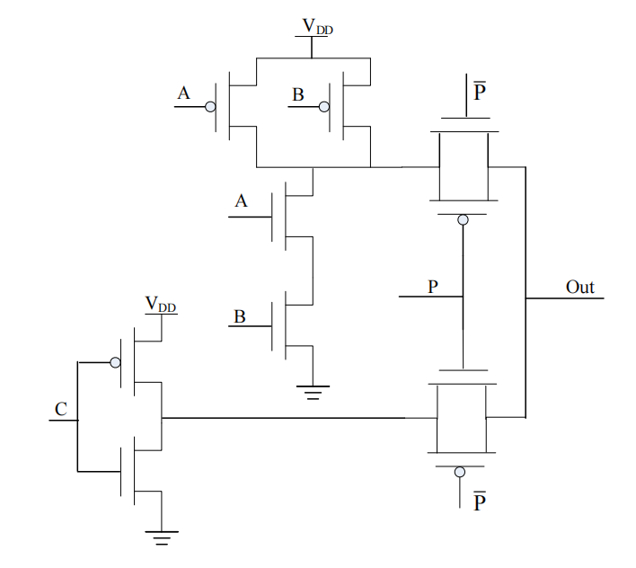

1. （P156）

   $\overline{AB+AC+BC}=\overline{AB+C(A+B)}$

   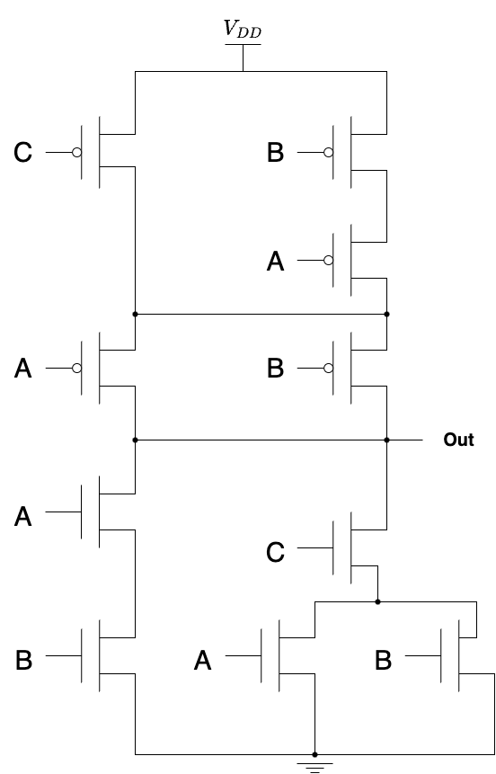

2. （P197）

   $Out=\overline{AB} \cdot \overline{BC} \cdot \overline{AC} = (\overline A+\overline B)(\overline A+\overline C)(\overline C+\overline B) =(\overline A+\overline B\cdot\overline C)(\overline B + \overline C)$

   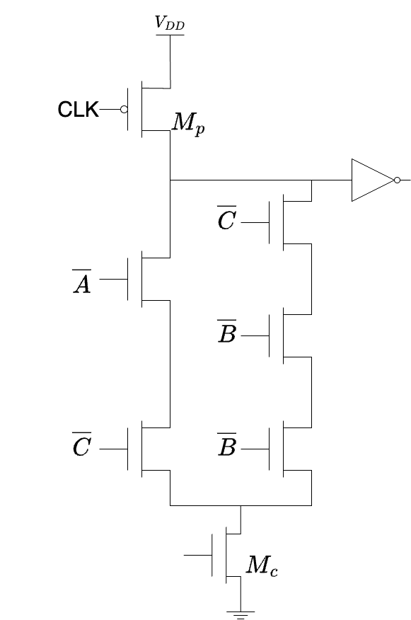

3. $Out=\overline C\cdot P + \overline{AB}\cdot \overline P$

## Q17

> 一个由两个相反类型的锁存器组成的寄存器（如下图所示），驱动端D由一个反相器所驱动，所有的交叉偶合反相器的 $W_p/W_n=2$，并且$W_p$和$W_n$均是$0.25\mu m$工艺的晶体管最小宽度尺寸，
>
> 1. 指出前后串联的锁存器的正负类型及该寄存器的正负沿类型；
> 2. 由于该寄存器的时钟开关采用的是传输管结构，请确定传输管的最小尺寸限制，确保能够在输入端D为“0”时，能够将其写入寄存器中（忽略沟道调制且如果发生漏电流饱和则为速度饱和，晶体管的其它参数参考教材表 3.2）；
> 3. 如果传输管的尺寸是确定的，并且不满足成功写入“0”的尺寸限制条件，如何采取其它方法来保证成功将“0”写入寄存器？
> 4. 如果传输管的延时是$t_T$，反相器的延时是$t_{INV}$，给出寄存器建立时间$t_{SU}$，传输延迟$t_{cq}$和维持时间$t_{hold}$。
>
> 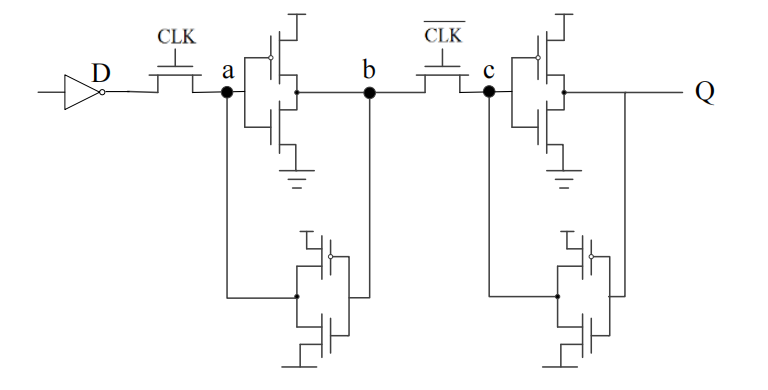

1. （P217）

   前一个锁存器在CLK为1时将输入传送到输出，是正锁存器；后一个寄存器在CLK为0时将输入传送到输出，是负锁存器

   该寄存器在1-0翻转时采样，是下降沿触发寄存器

2. （P227）

   为了使输入端 D 的信号0传到锁存器中，需要使a点的信号1被下拉为0，由于双稳态电路的驱动使a点保持1信号，因此在a点产生了竞争。为了确保a点的1信号变为0信号，A的驱动强度要大于后一个反馈反相器的驱动强度。如果能把a点下拉低于$V_{DD}/2$，表明成功将双稳态触发器的上方反相器输出上拉到阈值电压以上，即将0信号输入到寄存器中。

   这里假设CLK作为的输入端的NMOS和输入端的反相器中的NMOS型号相同，那么根据分压原理，D点的电压应该为$V_{DD}/4$，接下来，根据CLK所在的NMOS和反馈反相器中的PMOS，来计算漏极电流：
   $$
   |k'_n(W/L)_nV_{DSATn}((V_{DD}-\frac{V_{DD}}4)-V_{Tn}-V_{DSATn})| = |k'_p(W/L)_pV_{DSATp}((\frac{V_{DD}}2-V_{DD})-V_{Tp}-V_{DSATp})|
   $$
   得到等效比条件：
   $$
   \frac{(W/L)_n}{(W/L)_p}>0.13
   $$

3. 减小PMOS管 B的驱动强度，即减小其W/L。由于$W_p$已经是最小尺寸，所以可以增加$L_p$，使$W_p/L_p$减小。

4. （P215）

   $t_{su}$：当时钟下降沿到来时，信号需要通过一个传输门和一个反相器到达b点，因此$t_{su}=t_T+t_{INV}$。

   $t_{cq}$：时钟下降沿到来时，CLK信号需要一个反相器的延迟，信号传输需要经过一个传输门和一个反相器，因此$t_{cq}=t_+2t_{INV}$

   $t_{hold}$：本寄存器电路前端传输管在时钟下降沿到达后立即关闭，D的变化不会影响内部信号，因此$t_{hold}=0$

## Q18

> 下图中组合逻辑电路的反相器a的晶体管宽度$W_n=1\mu m$，$W_p=2\mu m$，单位晶体管宽度的栅电容 $C_g=2fF/\mu m$，$C_{out}=200fF$，（注：参考表 6.5）
>
> 1. 从In到Out电路的总路径努力是多少?
> 2. 使路径延时最小的门努力是多少？
>
> 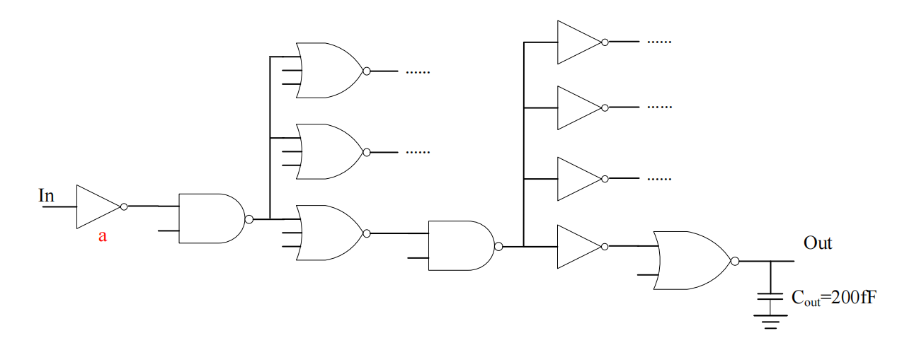

1. （P168，P166）

   路径逻辑努力：
   $$
   G=1\times\frac43\times\frac73\times\frac43\times1\times\frac53=\frac{560}{81}
   $$
   路径分支努力：
   $$
   B=1\times3\times1\times4\times1\times1=12
   $$
   第一级输入电容：
   $$
   C_{in}=C_g\times(W_n+W_p)=6fF
   $$
   

   路径电气努力：
   $$
   F=\frac{C_{out}}{C_{in}}=\frac{100}3
   $$
   总路径努力：
   $$
   H=GBF=2764
   $$

2. （P168）

   使路径延时最小的门努力：
   $$
   h=\sqrt[6]{H}=3.75
   $$

## Q19

> 下图是一个+1 循环计数器电路，循环计数器逻辑块的输入为4比特IN[3:0]，输出为4比特OUT[3:0]，比特位[3]表示最高位，比特位[0]表示最低位，循环计数器的最大计数为9(1001)，当输入IN[3:0]等于9时，输出OUT[3:0]等于0。
>
> 1. 对于 IN[3:0]的每一个比特位的 0 和 1 的概率 $p_0$ 和 $p_1$ 是多少？
> 2. 对于 IN[3:0]的每一个比特位从 0->1 的翻转因子各是多少？
> 3. 如果 IN[3:0]的每一个比特位的负载电容是$5fF$，OUT[3:0]的每一个比特位的负载电容是$4fF$，电路时钟频率为$ 250MHz$，$V_{DD}=2.5V$，计算该电路的动态功耗。
>
> 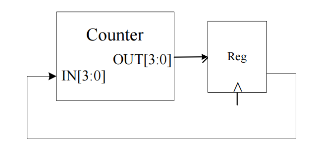

1. IN[0]: $p_0=0.5$，$p_1=0.5$

   IN[1]: $p_0=0.6$，$p_1=0.4$

   IN[2]: $p_0=0.6$，$p_1=0.4$

   IN[3]: $p_0=0.8$，$p_1=0.2$

2. $\alpha_0=0.5$（10次翻转里5次翻转0位）

   $\alpha_1=0.2$（0001->0010，0101->0110）

   $\alpha_2=0.1$（0011->0100）

   $\alpha_3=0.1$（0111->1000）

3. （P142）
   $$
   P=\sum_i\alpha_ifCV_{DD}^2=(0.5+0.2+0.1+0.1)\times250\times4\times2.5^2=12.7\mu W
   $$

## Q20

> 请分析下图带反馈的电路结构，其中寄存器是边沿触发的，并且 $t_{c-q,min}=2ns$，$t_{c-q, max}=4ns$，$t_{setup}=1ns$，$t_{hold}=1ns$
>
> 1. 如果没有时钟偏差和抖动发生，该系统的工作频率是多少？
> 2. 该系统能够允许的最大时钟偏差是多少？
>
> 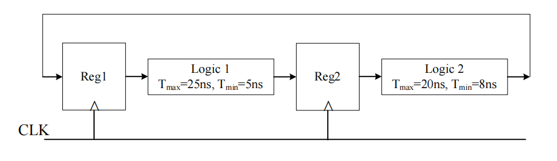

1. （P216或P237）
   $$
   T>t_{c-q}+t_{plogic}+t_{setup}=4+25+1=30ns
   $$

   $$
   f=1/T=33.3MHz
   $$

2. （P330）
   $$
   \delta < t_{c-q}+t_{plogic}-t_{hold} = 2+5-1=6ns
   $$
   

   